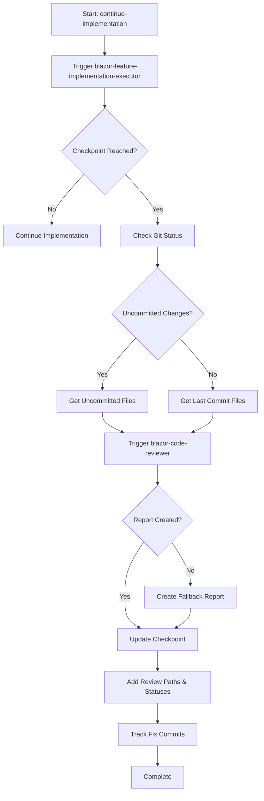

Triggers the blazor-feature-implementation-executor agent to continue implementing the current in-progress Blazor feature, with automatic code review generation and checkpoint updates.

## What this command does:

### Phase 1: Feature Implementation
Delegates to the @blazor-feature-implementation-executor agent which will:

1. **Identify** the current feature in /memory-bank/features/2-IN_PROGRESS/
2. **Find** the next uncompleted task or checkpoint in feature-tasks.md
3. **Execute** Blazor implementation following CODE_QUALITY_STANDARDS.md and ADMIN-CODE_QUALITY_STANDARDS.md
4. **Test** comprehensively with bUnit
5. **Stop** at checkpoints for validation

### Phase 2: Automatic Code Review (at checkpoints)
When the blazor-feature-implementation-executor reaches a checkpoint, this command will:

1. **Detect checkpoint completion** from the agent's response
2. **Determine review scope**:
   - If uncommitted changes exist: Review uncommitted files
   - If no uncommitted changes: Review files from last commit
3. **Trigger @blazor-code-reviewer** agent with the identified files
4. **VERIFY the review report was created**:
   - Check if the expected report file exists
   - If missing, create a fallback report with the Write tool
5. **Save the review report** to the correct location
6. **Update the checkpoint** with review results

### Phase 3: Checkpoint Update
After code review completion:

1. **Extract review status** (APPROVED/APPROVED_WITH_NOTES/REQUIRES_CHANGES)
2. **Update feature-tasks.md** checkpoint with:
   - Code review file paths (all iterations)
   - Review statuses
   - Git commit hashes for fixes
3. **Follow template** from `/memory-bank/Templates/FeatureCheckpointTemplate.md`

## Implementation Flow:



## Code Review File Structure:
```
/memory-bank/features/2-IN_PROGRESS/FEAT-XXX-[feature-name]/
├── code-reviews/
│   ├── Phase_1_[Name]/
│   │   ├── Code-Review-Phase-1-[Name]-YYYY-MM-DD-HH-MM-[STATUS]-001.md
│   │   └── Code-Review-Phase-1-[Name]-YYYY-MM-DD-HH-MM-[STATUS]-002.md
│   ├── Phase_2_[Name]/
│   │   └── Code-Review-Phase-2-[Name]-YYYY-MM-DD-HH-MM-[STATUS]-001.md
│   └── Phase_N_[Name]/
│       └── Code-Review-Phase-N-[Name]-YYYY-MM-DD-HH-MM-[STATUS]-001.md
```

## Checkpoint Update Format:
```markdown
## CHECKPOINT: Phase X Complete - [Description]
`[COMPLETE]` - Date: YYYY-MM-DD HH:MM

Build Report:
- Admin Project: ✅ 0 errors, 0 warnings
- Test Project: ✅ 0 errors, 0 warnings

[Implementation Summary]

Code Reviews:
- Review #1: `/memory-bank/features/2-IN_PROGRESS/FEAT-XXX/code-reviews/Phase_X_[Name]/Code-Review-Phase-X-[Name]-YYYY-MM-DD-HH-MM-[STATUS]-001.md` - [[STATUS]]
  - Fix Commit: `[HASH1]` - Address review findings #1
- Review #2: `/memory-bank/features/2-IN_PROGRESS/FEAT-XXX/code-reviews/Phase_X_[Name]/Code-Review-Phase-X-[Name]-YYYY-MM-DD-HH-MM-[STATUS]-002.md` - [[STATUS]]

Git Commits:
- `[HASH0]` - Initial implementation
- `[HASH1]` - Fix review findings #1
- `[HASH2]` - Final polish

Status: ✅ Phase X COMPLETE
Notes: 
- [Key accomplishments]
- [Review findings if applicable]
- Ready to proceed to Phase [X+1]
```

## Agent Invocation:

### Step 1: Execute Implementation
```
@blazor-feature-implementation-executor
```

### Step 2: Automatic Code Review (triggered by this command)
```
@blazor-code-reviewer (automatically invoked at checkpoints)
```

### Step 3: Verify Report Creation (CRITICAL)
After triggering the code reviewer, ALWAYS:
1. Use the Bash tool to check if report file exists:
   ```bash
   ls -la /path/to/expected/report/file.md
   ```
2. If file doesn't exist, immediately create fallback report using Write tool
3. Include in fallback report:
   - Current date/time
   - Build status (from `dotnet build`)
   - Test status (from `dotnet test`)
   - Files reviewed (from `git status`)
   - Status: REQUIRES_MANUAL_REVIEW or appropriate status
4. Save to exact expected path with correct naming convention

## Key Features:
- ✅ **Guaranteed Report Creation** with automatic fallback mechanism
- ✅ **Automated Code Reviews** at every checkpoint
- ✅ **Multiple review iterations** tracked with sequence numbers
- ✅ **Fix commits tracked** for each review iteration
- ✅ **Git Commit Hash** enforcement for traceability
- ✅ **Checkpoint template compliance** following standards
- ✅ **APPROVED_WITH_NOTES** handling (requires user confirmation)
- ✅ **Quality Gates** (0 errors, 0 warnings, all tests passing)
- ✅ **Task Tracking** via TodoWrite integration
- ✅ **No Task Left Behind** policy
- ✅ **Blazor standards** enforcement (CODE_QUALITY_STANDARDS.md, ADMIN-CODE_QUALITY_STANDARDS.md)
- ✅ **UI standards** compliance (UI_LIST_PAGE_DESIGN_STANDARDS.md)

## Error Handling:

### If Code Review Report Not Created:
The command will automatically:
1. **Detect missing report** by checking if file exists at expected path
2. **Generate fallback report** using the Write tool with:
   - Build status from `dotnet build` output
   - Test results from `dotnet test` output
   - List of reviewed files from git status
   - Default status of REQUIRES_MANUAL_REVIEW
3. **Save fallback report** to the expected location
4. **Continue with checkpoint update** using the fallback report

### If Code Review Fails:
- Report will be saved with REQUIRES_CHANGES status and sequence number
- Checkpoint will be updated with issues found
- User will be prompted to fix issues
- After fixes, new review will be generated with incremented sequence number
- All fix commits will be tracked

### If No Feature in Progress:
The agent will:
- Check /memory-bank/features/1-READY_TO_DEVELOP/
- Inform user if no active feature found
- Suggest using /start-implementing for new features

## Usage:
Simply run this command and everything will be handled automatically:
1. Implementation continues/starts
2. Code review generated at checkpoints
3. Multiple review iterations tracked with sequence numbers
4. Fix commits tracked for each review
5. Reports saved to files
6. Checkpoints updated with complete review history
7. Clear status provided to user

## Benefits:
- **Fully Automated**: No manual intervention needed for code reviews
- **Complete Audit Trail**: All review iterations and fix commits tracked
- **Guaranteed File Creation**: Review reports always saved to disk
- **Checkpoint Compliance**: Always follows the standard template
- **Traceability**: Complete history with git commits and reviews
- **Quality Assurance**: Automatic validation at every phase
- **Blazor-Specific**: Tailored for Blazor component and service development
- **Fallback Protection**: Ensures review reports are always created

## Fallback Report Template:

When the blazor-code-reviewer agent fails to create a report, use this template:

```markdown
# Code Review Report - Fallback

**Date**: [CURRENT_DATE_TIME]
**Scope**: [FEATURE_ID] Phase [X] - [Phase Description]
**Reviewer**: Automated Fallback System
**Review Type**: Fallback Review
**Status**: REQUIRES_MANUAL_REVIEW

## ⚠️ NOTICE
This is a fallback report generated because the blazor-code-reviewer agent did not create a report file.
Manual review may be required.

## Build & Test Status

**Build Status**: [Get from dotnet build output]
- Warnings: [Count]
- Errors: [Count]

**Test Results**: [Get from dotnet test output]
- Total Tests: [Count]
- Passed: [Count]
- Failed: [Count]

## Files for Review

The following files were identified for review:
[List files from git status or git show]

## Executive Summary

This fallback report was automatically generated to ensure checkpoint compliance.
The blazor-code-reviewer agent may have encountered an issue preventing report creation.

## Recommendation

1. Review the files manually
2. Run build and tests to verify quality
3. Consider re-running the code review agent
4. Update this report with actual findings if needed

## Review Outcome

**Status**: REQUIRES_MANUAL_REVIEW

---
*This fallback report was generated automatically to maintain audit trail integrity.*
```