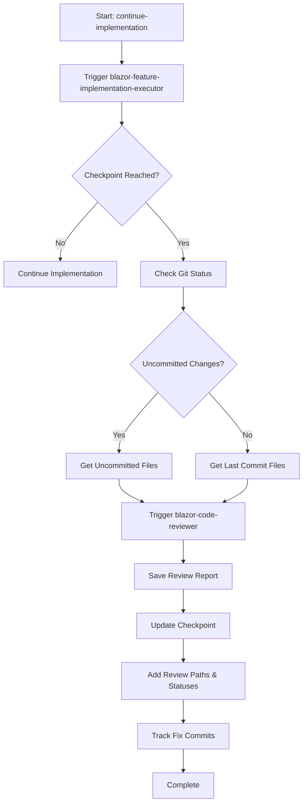

Triggers the blazor-feature-implementation-executor agent to continue implementing the current in-progress Blazor feature, with automatic code review generation and checkpoint updates.

## What this command does:

### Phase 1: Feature Implementation
Delegates to the @blazor-feature-implementation-executor agent which will:

1. **Identify** the current feature in /memory-bank/features/2-IN_PROGRESS/
2. **Find** the next uncompleted task or checkpoint in feature-tasks.md
3. **Execute** Blazor implementation following CODE_QUALITY_STANDARDS.md and ADMIN-CODE_QUALITY_STANDARDS.md
4. **Test** comprehensively with bUnit
5. **Stop** at checkpoints for validation

### Phase 2: Automatic Code Review (at checkpoints)
When the blazor-feature-implementation-executor reaches a checkpoint, this command will:

1. **Detect checkpoint completion** from the agent's response
2. **Determine review scope**:
   - If uncommitted changes exist: Review uncommitted files
   - If no uncommitted changes: Review files from last commit
3. **Trigger @blazor-code-reviewer** agent with the identified files
4. **Save the review report** to the correct location
5. **Update the checkpoint** with review results

### Phase 3: Checkpoint Update
After code review completion:

1. **Extract review status** (APPROVED/APPROVED_WITH_NOTES/REQUIRES_CHANGES)
2. **Update feature-tasks.md** checkpoint with:
   - Code review file paths (all iterations)
   - Review statuses
   - Git commit hashes for fixes
3. **Follow template** from `/memory-bank/Templates/FeatureCheckpointTemplate.md`

## Implementation Flow:



## Code Review File Structure:
```
/memory-bank/features/2-IN_PROGRESS/FEAT-XXX-[feature-name]/
├── code-reviews/
│   ├── Phase_1_[Name]/
│   │   ├── Code-Review-Phase-1-[Name]-YYYY-MM-DD-HH-MM-[STATUS]-001.md
│   │   └── Code-Review-Phase-1-[Name]-YYYY-MM-DD-HH-MM-[STATUS]-002.md
│   ├── Phase_2_[Name]/
│   │   └── Code-Review-Phase-2-[Name]-YYYY-MM-DD-HH-MM-[STATUS]-001.md
│   └── Phase_N_[Name]/
│       └── Code-Review-Phase-N-[Name]-YYYY-MM-DD-HH-MM-[STATUS]-001.md
```

## Checkpoint Update Format:
```markdown
## CHECKPOINT: Phase X Complete - [Description]
`[COMPLETE]` - Date: YYYY-MM-DD HH:MM

Build Report:
- Admin Project: ✅ 0 errors, 0 warnings
- Test Project: ✅ 0 errors, 0 warnings

[Implementation Summary]

Code Reviews:
- Review #1: `/memory-bank/features/2-IN_PROGRESS/FEAT-XXX/code-reviews/Phase_X_[Name]/Code-Review-Phase-X-[Name]-YYYY-MM-DD-HH-MM-[STATUS]-001.md` - [[STATUS]]
  - Fix Commit: `[HASH1]` - Address review findings #1
- Review #2: `/memory-bank/features/2-IN_PROGRESS/FEAT-XXX/code-reviews/Phase_X_[Name]/Code-Review-Phase-X-[Name]-YYYY-MM-DD-HH-MM-[STATUS]-002.md` - [[STATUS]]

Git Commits:
- `[HASH0]` - Initial implementation
- `[HASH1]` - Fix review findings #1
- `[HASH2]` - Final polish

Status: ✅ Phase X COMPLETE
Notes: 
- [Key accomplishments]
- [Review findings if applicable]
- Ready to proceed to Phase [X+1]
```

## Agent Invocation:

### Step 1: Execute Implementation
```
@blazor-feature-implementation-executor
```

### Step 2: Automatic Code Review (triggered by this command)
```
@blazor-code-reviewer (automatically invoked at checkpoints)
```

## Key Features:
- ✅ **Automated Code Reviews** at every checkpoint
- ✅ **Multiple review iterations** tracked with sequence numbers
- ✅ **Fix commits tracked** for each review iteration
- ✅ **Git Commit Hash** enforcement for traceability
- ✅ **Checkpoint template compliance** following standards
- ✅ **APPROVED_WITH_NOTES** handling (requires user confirmation)
- ✅ **Quality Gates** (0 errors, 0 warnings, all tests passing)
- ✅ **Task Tracking** via TodoWrite integration
- ✅ **No Task Left Behind** policy
- ✅ **Blazor standards** enforcement (CODE_QUALITY_STANDARDS.md, ADMIN-CODE_QUALITY_STANDARDS.md)
- ✅ **UI standards** compliance (UI_LIST_PAGE_DESIGN_STANDARDS.md)

## Error Handling:

### If Code Review Fails:
- Report will be saved with REQUIRES_CHANGES status and sequence number
- Checkpoint will be updated with issues found
- User will be prompted to fix issues
- After fixes, new review will be generated with incremented sequence number
- All fix commits will be tracked

### If No Feature in Progress:
The agent will:
- Check /memory-bank/features/1-READY_TO_DEVELOP/
- Inform user if no active feature found
- Suggest using /start-implementing for new features

## Usage:
Simply run this command and everything will be handled automatically:
1. Implementation continues/starts
2. Code review generated at checkpoints
3. Multiple review iterations tracked with sequence numbers
4. Fix commits tracked for each review
5. Reports saved to files
6. Checkpoints updated with complete review history
7. Clear status provided to user

## Benefits:
- **Fully Automated**: No manual intervention needed for code reviews
- **Complete Audit Trail**: All review iterations and fix commits tracked
- **Guaranteed File Creation**: Review reports always saved to disk
- **Checkpoint Compliance**: Always follows the standard template
- **Traceability**: Complete history with git commits and reviews
- **Quality Assurance**: Automatic validation at every phase
- **Blazor-Specific**: Tailored for Blazor component and service development