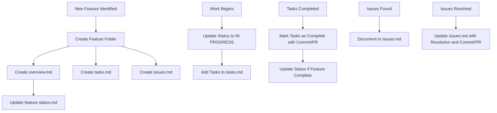

# Feature Documentation Workflow

This document outlines the process for creating and maintaining feature documentation in the memory bank.

## Documentation Structure

```
memory-bank/
├── features/
│   ├── feature-status.md (index of all features and their status)
│   ├── [feature-name]/
│   │   ├── overview.md (feature description, status, implementation details)
│   │   ├── tasks.md (tasks related to the feature)
│   │   └── issues.md (issues and their resolutions)
```

## Documentation Process



## Documentation Guidelines

### When to Create Documentation
- When a new feature is planned
- Before implementation begins
- As part of the planning process

### When to Update Documentation
- After completing significant tasks
- When resolving issues
- When changing feature direction
- After merging PRs related to the feature
- During regular memory bank reviews

### Documentation Responsibility
- The developer implementing the feature is responsible for initial documentation
- Anyone working on the feature should update relevant documentation
- Regular reviews should be conducted to ensure documentation stays current

### Documentation Format
- Follow the templates provided
- Be concise but complete
- Include all relevant technical details
- Link to external resources when appropriate
- Always include commit hashes and PR numbers for traceability

## Documentation Templates

### overview.md Template

```markdown
# [Feature Name]

## Status: [PLANNED/IN PROGRESS/IMPLEMENTED/NEEDS REVISION]

## Description
[Brief description of the feature and its purpose]

## Implementation Details
- [Key implementation detail 1]
- [Key implementation detail 2]
- [Key implementation detail 3]

## Related Components
- [Component 1]
- [Component 2]
- [Component 3]

## Documentation
- [Link to related documentation]

## Implementation History
| Date | Description | Commit | PR |
|------|-------------|--------|-----|
| [Date] | [Description] | [Commit] | [PR] |
```

### tasks.md Template

```markdown
# [Feature Name] Tasks

## Completed Tasks
- [x] [Task 1] ([Commit], PR [#])
- [x] [Task 2] ([Commit], PR [#])

## Pending Tasks
- [ ] [Task 3]
- [ ] [Task 4]

## Blocked Tasks
- [ ] [Task 5] (Blocked by: [Reason])
```

### issues.md Template

```markdown
# [Feature Name] Issues

## Active Issues
- [Issue description]

## Resolved Issues
- [Issue description] ([Commit], PR [#])
```

## Example Documentation Process

### Feature Planning
```
- Create feature folder in memory-bank/features/
- Create initial overview.md with feature description
- Create empty tasks.md and issues.md
- Add feature to feature-status.md with PLANNED status
```

### Implementation Begins
```
- Update feature status to IN PROGRESS
- Add detailed tasks to tasks.md
- Update overview.md with implementation details
```

### Task Completion
```
- Mark tasks as complete in tasks.md
- Add commit hash and PR number
- Update overview.md with new details if necessary
```

### Feature Completion
```
- Update feature status to IMPLEMENTED
- Ensure all tasks are marked complete
- Update overview.md with final implementation details
- Document any known limitations
```

### Issue Management
```
- Document issues as they are discovered
- Update with resolution details when fixed
- Include commit hash and PR number for the fix
```
