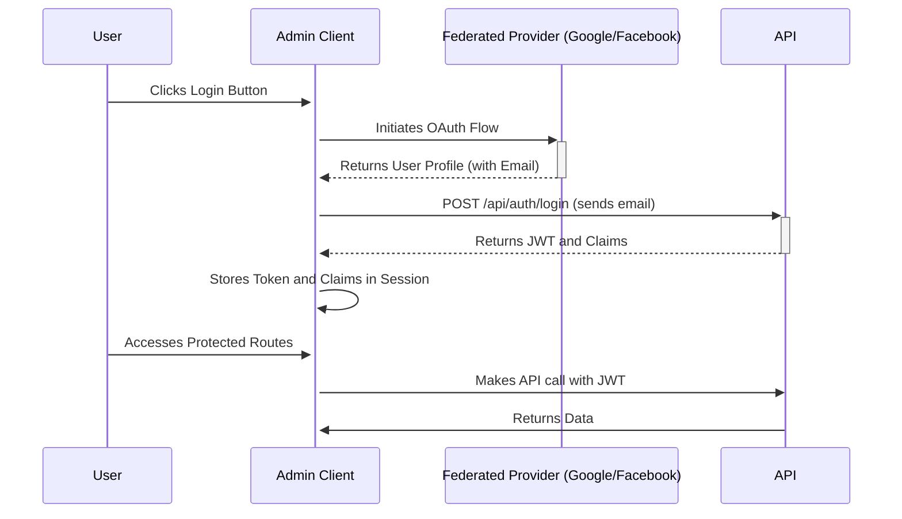

# API Authentication Flow

## 1. Feature Overview

This document specifies how the GetFitterGetBigger Admin application will interact with the new API-driven federated authentication system. The client is responsible for handling the user-facing login process (via Google and Facebook), communicating with the API's authentication endpoint, and managing the session token.

## 2. Authentication Flow

The client-side authentication process follows these steps:

1.  **Federated Login**: The user authenticates using the existing Google or Facebook login buttons in the application.
2.  **Email Extraction**: Upon a successful federated login, the application retrieves the user's email address.
3.  **API Authentication**: The application sends the user's email to the API's authentication endpoint: `POST /api/auth/login`.
4.  **Token and Claims Storage**: The application receives a JSON Web Token (JWT) and a list of user claims from the API. This data must be stored securely in the user's session (e.g., browser session storage).



---

## 3. API Interaction

### Authentication Endpoint

*   **URL**: `POST /api/auth/login`
*   **Description**: Exchanges a user's email for a session token (JWT) and a list of their permissions (claims).

### Data Transfer Objects (DTOs)

The following C# records should be used for communication with the API. These should be defined in a shared project or within the Admin client's models.

**Request DTO**:
```csharp
public record AuthenticationRequest(string Email);
```

**Response DTOs**:
```csharp
public record AuthenticationResponse(string Token, List<ClaimInfo> Claims);

public record ClaimInfo(string ClaimId, DateTime? ExpirationDate, string? Resource);
```

### Example Interaction

**Request from Admin Client**:
```http
POST /api/auth/login
Content-Type: application/json

{
  "email": "personal.trainer@example.com"
}
```

**Response from API**:
```http
HTTP/1.1 200 OK
Content-Type: application/json
X-Refreshed-Token: eyJhbGciOiJIUzI1NiIsInR5cCI6IkpXVCJ9.eyJzdWIiOi...

{
  "token": "eyJhbGciOiJIUzI1NiIsInR5cCI6IkpXVCJ9.eyJzdWIiOi...",
  "claims": [
    {
      "claimId": "claim-...",
      "expirationDate": null,
      "resource": null
    }
  ]
}
```

---

## 4. Session Management

### Attaching the Token

An `HttpClient` message handler (e.g., a `DelegatingHandler`) must be implemented. This handler will intercept every outgoing API request and perform the following actions:
1.  Retrieve the JWT from session storage.
2.  If a token exists, add it to the request's `Authorization` header as a bearer token.
    ```
    Authorization: Bearer <jwt_token>
    ```

### Handling Sliding Expiration

The API uses a sliding token expiration model. A refreshed token will be sent back in the `X-Refreshed-Token` response header of every successful API call.

The `DelegatingHandler` must also be responsible for:
1.  Checking for the `X-Refreshed-Token` header in API responses.
2.  If the header is present, its value (the new JWT) must be used to update the token in session storage. This keeps the user's session alive as they interact with the application.

---

## 5. Error Handling

### Expired Session

If the user's session expires, the API will respond to a request with a `401 Unauthorized` status and a specific error message.

**API Error Response**:
```json
{
  "error": "UserExpired",
  "message": "The session has expired. Please log in again."
}
```

The application's API service layer must be configured to globally handle this specific error. When a `401` response with the `"UserExpired"` error is detected, the application must:
1.  Clear any stored session data (token, claims, user info).
2.  Automatically redirect the user to the login page to re-authenticate.
