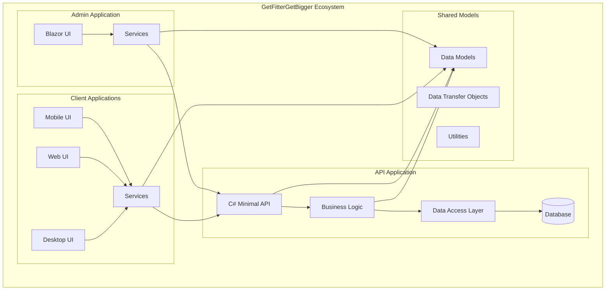

# System Patterns

## System Architecture

The GetFitterGetBigger ecosystem follows a distributed architecture pattern with specialized applications communicating through a central API layer:

```
┌─────────────────────┐      ┌─────────────────────┐
│                     │      │                     │
│  Admin Application  │◄────►│    API Service      │◄────┐
│  (Blazor Web App)   │      │  (C# Minimal API)   │     │
│                     │      │                     │     │
└─────────────────────┘      └─────────────────────┘     │
                                      ▲                  │
                                      │                  │
                                      ▼                  ▼
                             ┌─────────────────────┐    ┌─────────────────────┐
                             │                     │    │                     │
                             │  Client Applications│    │      Database       │
                             │  (Avalonia UI)      │    │                     │
                             │                     │    │                     │
                             └─────────────────────┘    └─────────────────────┘
```

For a more detailed view of the architecture, here's a mermaid diagram showing the internal components and their relationships:



### Key Components

1. **Admin Application**
   - Blazor-based web application
   - Responsible for content creation and management
   - Communicates exclusively through the API layer
   - No direct database access

2. **API Application**
   - Central communication hub
   - Implements business logic and data validation
   - Manages database interactions
   - Provides standardized endpoints for all applications

3. **Client Applications**
   - Cross-platform applications built with Avalonia UI
   - Used by fitness enthusiasts to perform workouts
   - Track progress and provide feedback
   - Communicate through the same API layer

4. **Shared Models (This Project)**
   - Provides consistent data structures across all components
   - Ensures data integrity throughout the ecosystem
   - Simplifies development and maintenance

## Key Technical Decisions

### 1. API-First Architecture

The decision to implement an API-first architecture provides several benefits:

- **Separation of Concerns**: Each application focuses on its specific role
- **Consistency**: Business logic centralized in the API layer
- **Scalability**: Applications can be scaled independently
- **Technology Flexibility**: Different technologies can be used for each application
- **Future-Proofing**: New client applications can be added without changing the core system

### 2. Shared Models

The decision to use shared models across all components provides several benefits:

- **Consistency**: Ensures that all components use the same data structures
- **Reusability**: Reduces duplication of code
- **Maintainability**: Changes to data structures only need to be made in one place
- **Interoperability**: Simplifies communication between components

### 3. Cross-Platform Client Applications

The decision to use Avalonia UI for client applications provides several benefits:

- **Code Sharing**: Most code can be shared across all platforms
- **Consistent Experience**: Users get a similar experience regardless of platform
- **Reduced Development Effort**: Single codebase for multiple platforms
- **Simplified Maintenance**: Bug fixes and feature additions apply to all platforms

## Component Relationships

### Data Flow Patterns

1. **Create/Update Flow**:
   - Admin App creates/modifies content
   - API validates and processes the data
   - API stores data in the database
   - Changes propagate to client applications

2. **Read Flow**:
   - Client App requests data
   - API retrieves from database
   - API formats and returns data
   - Client App renders the information

3. **Feedback Flow**:
   - Client App records user feedback
   - API stores feedback in the database
   - Admin App retrieves feedback
   - PT reviews and responds to feedback

### Communication Patterns

1. **RESTful API**:
   - Standard HTTP methods (GET, POST, PUT, DELETE)
   - JSON data format
   - Authentication via JWT tokens
   - Versioned endpoints

2. **Data Transfer Objects (DTOs)**:
   - Used for communication between components
   - Simplified versions of domain models
   - Tailored to specific use cases

## Critical Implementation Paths

1. **Authentication System**
   - User registration and login
   - JWT token generation and validation
   - Role-based authorization
   - Secure password handling

2. **Exercise Management**
   - Exercise creation and editing
   - Categorization and tagging
   - Media attachment (images, videos)
   - Search and filtering

3. **Workout Builder**
   - Exercise selection and sequencing
   - Set/rep/rest parameter configuration
   - Workout templates and variations
   - Validation and completeness checking

4. **Training Plan Composer**
   - Calendar-based workout assignment
   - Plan templates and customization
   - Client assignment and tracking
   - Progress visualization

5. **Progress Tracking**
   - Workout completion recording
   - Performance metrics calculation
   - Progress visualization
   - Achievement recognition
